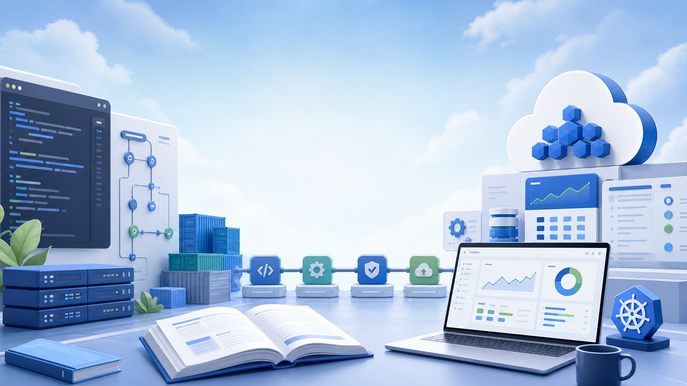

# Compute Central

**Compute Central** is a practical DevOps and cloud engineering knowledge base built around real infrastructure work.

Use it to learn, revise, and apply topics such as Linux, containers, Kubernetes, CI/CD, Terraform, Ansible, monitoring, troubleshooting, and system design. The focus is simple: explain concepts clearly, show how they work in practice, and connect them to day-to-day operations.

{ .cc-hero-image }

## Start Here

<a class="cc-card" href="kubernetes/">
  <strong>Kubernetes and OpenShift</strong>
  Learn core concepts, OpenShift operations, labs, troubleshooting, and quick-reference commands.
</a>

<a class="cc-card" href="ansible/ansible/">
  <strong>Automation</strong>
  Build repeatable workflows with Ansible, shell scripting, Terraform, and practical infrastructure examples.
</a>

<a class="cc-card" href="jenkins/jenkins/">
  <strong>CI/CD and Code Quality</strong>
  Set up Jenkins pipelines, SonarQube checks, and deployment workflows that are easier to review and operate.
</a>

<a class="cc-card" href="monitoring-tools/">
  <strong>Monitoring and SRE</strong>
  Use Prometheus, Grafana, Alertmanager, Loki, and troubleshooting patterns to understand system health.
</a>

## What You Will Find

- Step-by-step guides for common DevOps and SRE tasks
- Kubernetes, OpenShift, Docker, Terraform, Ansible, Jenkins, and SonarQube notes
- Monitoring and troubleshooting workflows for production-style systems
- Architecture and system design references for platform engineering
- Scripts, examples, and checklists that are easy to adapt

## Learning Paths

| Goal | Good starting point |
| --- | --- |
| Learn containers and orchestration | [Docker guide](docker/docker.md), then [Kubernetes fundamentals](kubernetes/fundamentals.md) |
| Practice Kubernetes locally | [Minikube lab](kubernetes/labs/minikube-lab.md), [Docker Desktop lab](kubernetes/labs/docker-lab.md), or [Podman lab](kubernetes/labs/podman-lab.md) |
| Automate server work | [Ansible overview](ansible/ansible.md), [Ansible playbooks](ansible/playbooks.md), and [shell scripts](shell-scripts/scripts.md) |
| Improve delivery pipelines | [Jenkins setup](jenkins/jenkins.md), [SonarQube integration](sonarqube/jenkins-integration.md), and [Kubernetes CI/CD](kubernetes/operations/cicd-pipelines.md) |
| Operate production-style systems | [Monitoring stack](monitoring-tools/index.md), [Kubernetes troubleshooting](kubernetes/operations/troubleshooting.md), and [system design](system-design/index.md) |

## How to Use This Site

Start with the topic you need, then follow the examples in a local or test environment before using them in production. Most pages are written to help you understand the reason behind each step, not just copy a command and move on.

!!! tip "Best way to learn"
    Read the short explanation first, run the example safely, then write down what changed and why it worked.

!!! note "Production reminder"
    Always review commands, credentials, namespaces, and environment names before running anything against shared or production systems.

## About Sameer Alam

I’m **Sameer Alam**, a DevOps Engineer and SRE practitioner focused on reliable, automated, observable, and secure systems.

My work includes infrastructure design, deployment automation, monitoring, incident response, platform operations, and simplifying complex workflows for teams.

I started documenting my learning in **2016**. Compute Central brings those notes, experiments, and real-world lessons into one organized place.

## Links

- **GitHub:** [github.com/sameeralam3127](https://github.com/sameeralam3127)
- **Medium:** [medium.com/@sameeralam3127](https://medium.com/@sameeralam3127)
- **Blog archive:** [compute-central.blogspot.com](https://compute-central.blogspot.com/)
